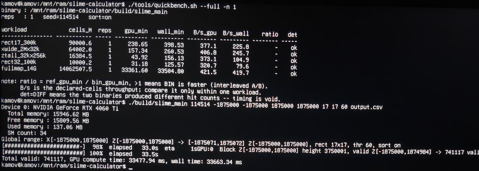
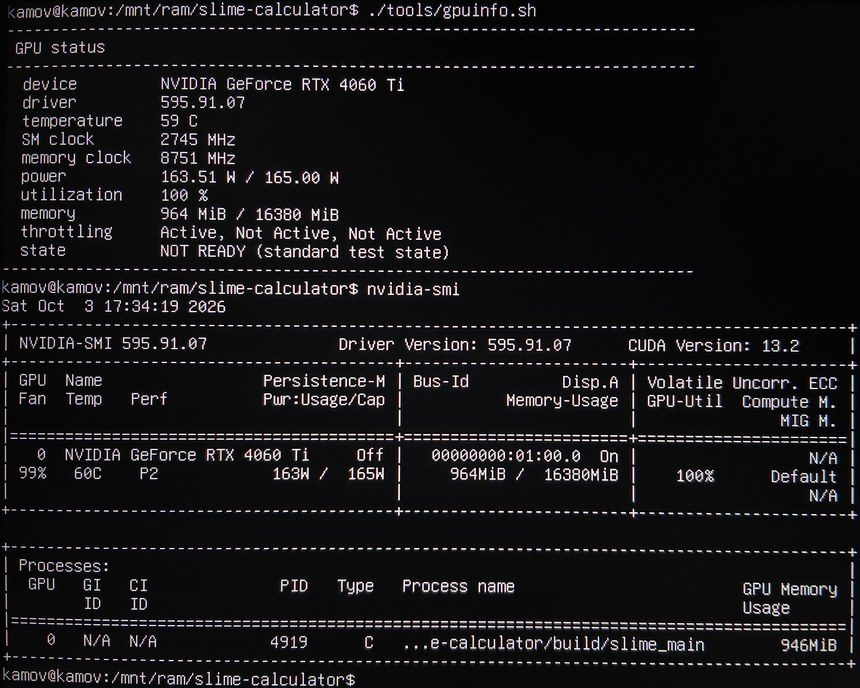

# Slime Calculator / 史莱姆计算器

[English](README.md) | **简体中文**

基于 CUDA 的 Minecraft 史莱姆区块查找器。仅支持 Java 版。

## 快速开始

```bash
git clone <仓库地址>
cd slime-calculator
./build.sh
./build/slime_main 12345 -10 -10 10 10 5 5 3 output.csv
```

扫描种子 `12345`、区块坐标 `(-10,-10)` 到 `(10,10)` 区域内所有 5×5 区块大小、至少包含 3 个史莱姆区块的矩形区域。

## 编译

```bash
./build.sh
```

三个可执行文件输出到 `build/` 目录。

## 工具

### slime_main

主扫描器，使用 CUDA 在矩形区域内搜索史莱姆区块。

```bash
./build/slime_main <seed> <startX> <startZ> <endX> <endZ> <sizeX> <sizeZ> <threshold> <output.csv> [--sort=on|off]
```

在指定矩形区域 `(startX, startZ)`–`(endX, endZ)` 内搜索所有尺寸为 `sizeX` × `sizeZ`、至少包含 `threshold` 个史莱姆区块的矩形区域。坐标为区块坐标（整数）。`sizeX` 必须 ≤ 255、`sizeZ` 必须 ≤ 32：这是由 `uint8_t` 前缀和与滑动窗口环形缓冲推导出的硬界，程序启动时会校验，越界会直接报错退出。`--sort`（默认 `on`）让程序直接按 `(x,z)` 输出。结果池用**一次 `malloc`** 申请一块尽可能大的内存（可用物理内存的 50%、上限 8GB、下限 4 个块），直到运行结束都不 free、不重新 malloc。一组排序线程（最多 10 个）在 **GPU 还在扫的时候**就把每个满块就地排成 `(x,z)` 有序段 —— 排序与 GPU 并行、段与段也彼此独立，因此随核数线性加速。内存用尽时把已排序段落盘成 `<output>.runN` 并回收该块，内存始终有界；收尾时对「内存段 + 落盘段」做一遍 k 路归并写出 CSV（那些 run 文件会删除）。`--sort=off` 完全不排序，边扫边流式写 CSV。代价：最大基准（4.35M 行）上约 **+1.4%** 墙钟（只剩收尾归并与串行的 CSV 写入，排序本身已被 GPU 时间遮住），换来测试流程里彻底去掉外部 `LC_ALL=C sort`。

坐标还被限制在 |区块坐标| ≤ 2,000,000（仍在原版世界边界 ±1,874,999 之外一点，且远小于 `INT_MAX`）：这个界是「结果缓冲区几何可证明安全」的前提（见设计笔记）。回退路径（`sizeX > 32`）仍沿 Z 分块以适配显存；融合路径在单卡上把整块 Z 放进一个 block，改为按自适应 chunk 在 Z 方向流式推进。

选区的四个顶点严格保证在搜索范围内。但为了优化 GPU 显存对齐，内部实际使用的区域会向 256 取整，可能会略微扩大扫描范围。

### 性能

在 RTX 4060 Ti 16GB 的标准测试状态（起始 ≤35 °C、SM 2340 MHz、显存 9001 MHz 锁定）下，
以下命令三次重复中最快一次为 **37.1 秒**（其中 GPU 时间 35.6 秒），输出 40,700,773 行：

```bash
./build/slime_main 114514 -1875000 -1875000 1875000 1875000 17 17 55 output.csv
```

> 绝对秒数取决于宿主机与机器状态（是否锁频、起始温度），引用时应连同测量环境一起给出。

上面是锁频、低温起步下的口径。宿主不锁频、让显卡正常睿频时，同一个二进制在无头裸机上是这样：



*`quickbench.sh --full -n 1` 在无头裸机上跑，同一张卡、驱动 595.91.07，未锁频：
单次全图检查 1.40625e13 个候选中心，**gpu 33.36 秒 / 墙钟 33.50 秒 = 端到端 419.7 B/s**，
所有负载 `det=ok`。程序自报该次运行：74,117 个命中、58 个 chunk，gpu 33.48 秒 / 墙钟 33.66 秒。

绝对秒数与宿主机强相关 —— 无头裸机、图形化桌面、虚拟化环境跑同一个二进制会给出不同的数字，
所以秒数只有连同测量环境一起看才有意义；同一负载内可比的是 B/s 与 `det=ok`。*

输出（世界/方块坐标）：

```
x,z,slime_count
```

### 基准测试

```bash
./bench.sh --quick     # 两个小负载
./bench.sh             # 小负载 + X 主导 + Z 主导
./bench.sh --full      # 追加上面那条 3.75M×3.75M 负载（测试时钟下约 37 秒/次）
```

三个小工具负责取数与自检：`gpuinfo.sh` 打印 GPU 状态；`quickbench.sh` 打多种负载形状的速度表；
`quickcheck.sh` 约十秒内拿独立 Java oracle 校验输出。
它们读的是运行时真实值、不硬编码本机频率，所以随仓库发布，在任意有 CUDA GPU 的机器上都可用。

真正与机器绑定的脚本（GPU 全局互斥、起始温度对齐、降温约定）才只留在工作区、被 `.gitignore`
排除在外。凡是会调用它们的脚本都做了存在性检测：缺失时明确报「已跳过」，不会静默失败。

`tools/collect.sh` 一条命令即可采集完整的性能与正确性快照（GPU 状态、全图耗时、ncu 指标与
原始报告、位精确矩阵、真 JVM 对拍、oracle 全量比对），写到 `.work/collect/<时间戳>/` 并在旁边
打一份同名归档（源目录保留），目录里的 `SUMMARY.md` 记着每个文件是什么、各阶段结论如何。



*`gpuinfo.sh` 在跑测过程中执行：59 °C、SM 2745 MHz、显存 8751 MHz、163.51 W / 165 W 上限、
利用率 100%，于是如实判 **NOT READY**（标准状态是起始 ≤35 °C、SM 2340 MHz、显存 9001 MHz）。
下面那半是同一张卡的 `nvidia-smi`，可以看到 `slime_main` 进程占着 946 MiB。
只有从同一状态起步的两次测量才能比绝对时间。*

每个负载先预热 1 次，再测 `--reps` 次（默认 3）；结果表给出 min/median/mean 墙钟、各分块 GPU 耗时之和、命中数、速度 **B/s**（每秒检查十亿个候选中心，候选中心 = 请求区域内所有窗口左上角位置，`cells_M / ms == B/s`；`B/s_min` 取最快一次、`B/s_avg` 取各次平均），以及 `det` 列（对输出 CSV 用 `LC_ALL=C sort` 排序后比较 md5——输出顺序由 `atomicAdd` 决定、本身不保证稳定，而排序必须用 C locale，否则中文 locale 下 `,`/`-` 被主级比较忽略会使 `sort` 失去全序）。`--save results.csv` 记录逐次数据，`--baseline results.csv` 打印相对上一次保存结果的变化百分比，这是衡量优化的正式方式；`det=DIFF` 表示同样输入下输出内容变了，此时速度数字无效。回退路径（`sizeX > 32`）按空闲显存取 `H_max`（`d_row_ps = width * H_max`），Z 方向扫描区间也会随之向两端扩张，那一路在不同显存状态下不完全可比；融合路径（`sizeX <= 32`）不分配 `d_row_ps`，单卡时 `H_max` 直接等于整块 Z，因此扫描范围就是请求范围，结果缓冲区大小（`cap`）只影响「缓冲区写满后 drain 一次」的频率，不影响输出内容；B/s 也与负载形状强相关，只应在同一负载内比较版本。结果通过手写的 pinned FIFO 结果池（`ResultPool`）交给独立写盘线程，CSV 格式化与 GPU 计算重叠；因此「各分块 GPU 耗时之和」只含扫描与 D2H、不含格式化，改动前后 `gpu_min`/`B/s_avg` 不再严格可比——跨这个改动比较时请用墙钟口径的 `B/s_min`。

`slime_main.cu` 另有两个诊断编译开关：`-DSLIME_PROFILE` 用 CUDA event 把行前缀核与滑窗核的耗时分开，并打印一行 `PROFILE: row-prefix kernel ... sliding-window + D2H/launch ...`；`-DSLIME_SCAN_ONLY` 只保留命中判定、不做登记（无 `atomicAdd`、无 `d_results` 写入、无 D2H 拷贝、无 CSV 行），用来确认结果登记路径的开销。编译期旋钮 `-DSLIME_Z_SUB_ROWS=<N>` / `-DSLIME_Z_SPLIT_MIN_TILES=<N>` 控制融合核沿 Z 的切分（测试里用它们强制走不切分那条路径）。环境变量 `SLIME_CAP_SLOTS=<slots>` 可以覆盖结果缓冲区大小（会被夹到至少一整行候选），把它设小就能让每个 chunk 都走「缓冲区满 -> 丢弃本轮、缩小 chunk 重试」的路径，这条路径就是这样测的。另一个要知道的不变式是 `cap >= rangeX`：命中数恒不超过候选数，所以 `cap / rangeX` 行候选组成的 chunk 永远不可能溢出。

```bash
nvcc -o build/slime_main_prof src/slime_main.cu -O3 -use_fast_math -arch=sm_89 -DSLIME_PROFILE
nvcc -o build/slime_main_scan src/slime_main.cu -O3 -use_fast_math -arch=sm_89 -DSLIME_SCAN_ONLY
```

### slime_circle

基于圆形区域的二级筛选。

```bash
./build/slime_circle <input_csv> <radius> <sizeX> <sizeZ> <seed> <output_csv> <threshold>
```

读取 `slime_main` 的输出，查找其半径为 `radius` 的圆形区域内包含超过 `threshold` 个史莱姆区块的子矩形。

### slime_cmp

基于距离的后置筛选。

```bash
./build/slime_cmp <input_csv> <distance> <threshold> <output_csv>
```

筛选离 `(0,0)` 的区块距离 ≤ `distance` 且史莱姆数量 ≥ `threshold` 的记录。

输出：

```
x,z,slime_count,distance
```

### test

一个论证工具，用于证明 Java 的 `nextInt` 拒绝采样最多只需要一次迭代。枚举所有坏种子（8 个可能的 `u` 值 × 2¹⁷ 个低比特组合），然后对种子图做 DFS 计算最长连续坏种子链。结果为 1，说明没有坏种子会生成另一个坏种子，因此 CUDA kernel 中的 `do-while` 可以安全地替换为 `if`。

```bash
./build/test
```

## 完整流程

```
slime_main  <seed> <area> <rect> <threshold>  → candidates.csv
slime_circle candidates.csv <radius> <rect> <seed> <threshold>  → circles.csv
slime_cmp   circles.csv <distance> <threshold>  → result.csv
```
